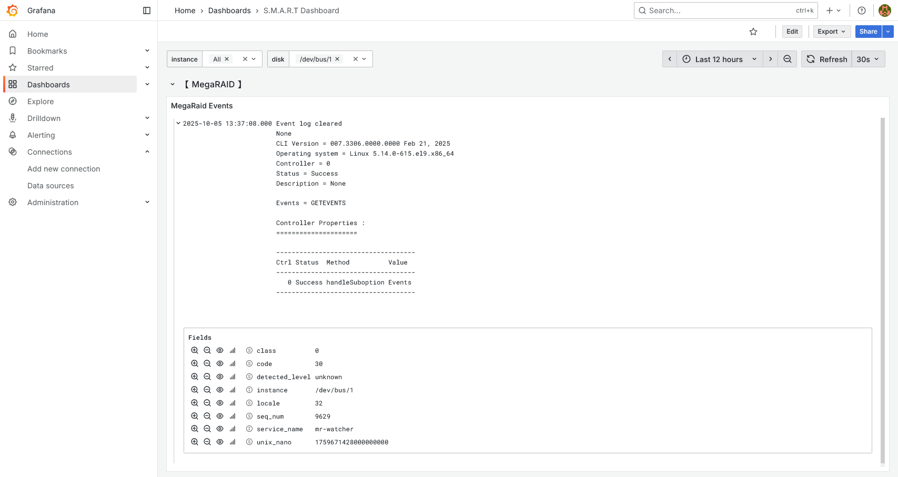

# MR_EventWatcher
scrape Events from your LSI MegaRAID card and post them to Grafana Loki for visualization and alert

* * *

## Prerequisite

1. install MegaRAID storcli (may refer to: https://docs.broadcom.com/docs/MR-TM-StorCLI-UG)
2. run Grafana & Loki service (may refer to: https://grafana.com/docs/loki/latest/setup/install/)
3. Go environment for build (may refer to: https://go.dev/dl/)

## Preparation

1. Add a cronjob to export MegaRAID events

```shell
crontab -e
mkdir -p /tmp/mr-logs
*/5 * * * * /opt/MegaRAID/storcli/storcli64 /c0 show events > /tmp/mr-logs/sas.log
```

In this case we export events of card0 to dir: `/tmp/mr-logs` every 5 minutes.

2. Customize your configs

This Watcher uses config.yaml as configuration file.

```yaml
log_scrape:
  log_path: "/tmp/mr-logs/sas.log" # path to lsi event logs
  interval: 15s # scrape interval
  start_time: "2025-10-01 00:00:00" # scrape start time (only when first run)
```

Note that `log_scrape.start_time` is defined as the first start position to post to loki

If the program has been run for more than one time, the position will be stored to `.pos.data` file, same directory with program executable.

The format of `.pos.dat` file is `\n` separated: `${LastTimeStamp}\n${LastLogSequence}`, for example:

```text
2025-10-03T03:40:24Z
9628
```

If `.pos.dat` exists, the program will always post events newer than this position. 

And if you want to reset the timestamp, just remove this file.

3. Build & Run

```bash
go build mr-watcher.go
nohup ./mr-watcher &
```

4. Build your Grafana visualization & alert rules



`class(LSI LogLevel)`, `code(LSI LogType)`, `locale(LSI LogRole)`, etc. are send to Loki as metadata

You can add some customized alert rules according to them later.
